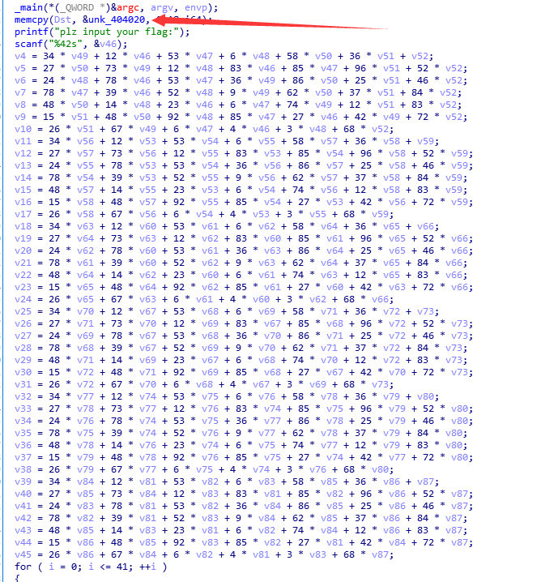
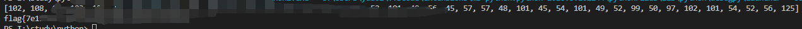

# 2020国赛

## misc

### 签到

​	打开即可得到答案。

### the_best_ctf_game

​	打开后是个文件，在ubuntu里cat 打开后取每一段文字的最后一个字，拼凑即可得到flag。


## web


## re

### Z3

下载完以后在IDA64里运行，找到main函数，F5反汇编，找到结果，



双击得到式子的汇编，D键修改为dd，然后用H转成10进制数，这就是原函数对应的答案，将原函数看做线性代数，在python里解出flag的ascii值，再转成字符串即可得到FLAG。

```python
from z3 import *
a1=[BitVec('v%d' % i, 16) for i in range(42)]
s=Solver()
#s.add(20247 ==== 34 * a1[3] + 12 * a1[0] + 53 * a1[1] + 6 * a1[2] + 58 * a1[4] + 36 * a1[5] + a1[6])
s.add(20247 == 34 * a1[3] + 12 * a1[0] + 53 * a1[1] + 6 * a1[2] + 58 * a1[4] + 36 * a1[5] + a1[6])
s.add(40182 == 27 * a1[4] + 73 * a1[3] + 12 * a1[2] + 83 * a1[0] + 85 * a1[1] + 96 * a1[5] + 52 * a1[6])
s.add(36315 == 24 * a1[2] + 78 * a1[0] + 53 * a1[1] + 36 * a1[3] + 86 * a1[4] + 25 * a1[5] + 46 * a1[6])
s.add(36518 == 78 * a1[1] + 39 * a1[0] + 52 * a1[2] + 9 * a1[3] + 62 * a1[4] + 37 * a1[5] + 84 * a1[6])
s.add(26921 == 48 * a1[4] + 14 * a1[2] + 23 * a1[0] + 6 * a1[1] + 74 * a1[3] + 12 * a1[5] + 83 * a1[6])
s.add(39185 == 15 * a1[5] + 48 * a1[4] + 92 * a1[2] + 85 * a1[1] + 27 * a1[0] + 42 * a1[3] + 72 * a1[6])
s.add(16546 == 26 * a1[5] + 67 * a1[3] + 6 * a1[1] + 4 * a1[0] + 3 * a1[2] + 68 * a1[6])
s.add(12094 == 34 * a1[10] + 12 * a1[7] + 53 * a1[8] + 6 * a1[9] + 58 * a1[11] + 36 * a1[12] + a1[13])
s.add(25270 == 27 * a1[11] + 73 * a1[10] + 12 * a1[9] + 83 * a1[7] + 85 * a1[8] + 96 * a1[12] + 52 * a1[13]) 
s.add(19330 == 24 * a1[9] + 78 * a1[7] + 53 * a1[8] + 36 * a1[10] + 86 * a1[11] + 25 * a1[12] + 46 * a1[13])
s.add(18540 == 78 * a1[8] + 39 * a1[7] + 52 * a1[9] + 9 * a1[10] + 62 * a1[11] + 37 * a1[12] + 84 * a1[13])
s.add(16386 == 48 * a1[11] + 14 * a1[9] + 23 * a1[7] + 6 * a1[8] + 74 * a1[10] + 12 * a1[12] + 83 * a1[13])
s.add(21207 == 15 * a1[12] + 48 * a1[11] + 92 * a1[9] + 85 * a1[8] + 27 * a1[7] + 42 * a1[10] + 72 * a1[13])
s.add(11759 == 26 * a1[12] + 67 * a1[10] + 6 * a1[8] + 4 * a1[7] + 3 * a1[9] + 68 * a1[13])
s.add(10460 == 34 * a1[17] + 12 * a1[14] + 53 * a1[15] + 6 * a1[16] + 58 * a1[18] + 36 * a1[19] + a1[20]) 
s.add(25613 == 27 * a1[18] + 73 * a1[17] + 12 * a1[16] + 83 * a1[14] + 85 * a1[15] + 96 * a1[19] + 52 * a1[20]) 
s.add(21135 == 24 * a1[16] + 78 * a1[14] + 53 * a1[15] + 36 * a1[17] + 86 * a1[18] + 25 * a1[19] + 46 * a1[20])
s.add(24891 == 78 * a1[15] + 39 * a1[14] + 52 * a1[16] + 9 * a1[17] + 62 * a1[18] + 37 * a1[19] + 84 * a1[20])
s.add(18305 == 48 * a1[18] + 14 * a1[16] + 23 * a1[14] + 6 * a1[15] + 74 * a1[17] + 12 * a1[19] + 83 * a1[20])
s.add(27415 == 15 * a1[19] + 48 * a1[18] + 92 * a1[16] + 85 * a1[15] + 27 * a1[14] + 42 * a1[17] + 72 * a1[20])
s.add(12855 == 26 * a1[19] + 67 * a1[17] + 6 * a1[15] + 4 * a1[14] + 3 * a1[16] + 68 * a1[20])
s.add(10899 == 34 * a1[24] + 12 * a1[21] + 53 * a1[22] + 6 * a1[23] + 58 * a1[25] + 36 * a1[26] + a1[27]) 
s.add(24927 == 27 * a1[25] + 73 * a1[24] + 12 * a1[23] + 83 * a1[21] + 85 * a1[22] + 96 * a1[26] + 52 * a1[27]) 
s.add(20670 == 24 * a1[23] + 78 * a1[21] + 53 * a1[22] + 36 * a1[24] + 86 * a1[25] + 25 * a1[26] + 46 * a1[27])
s.add(22926 == 78 * a1[22] + 39 * a1[21] + 52 * a1[23] + 9 * a1[24] + 62 * a1[25] + 37 * a1[26] + 84 * a1[27])
s.add(18006 == 48 * a1[25] + 14 * a1[23] + 23 * a1[21] + 6 * a1[22] + 74 * a1[24] + 12 * a1[26] + 83 * a1[27])
s.add(23345 == 15 * a1[26] + 48 * a1[25] + 92 * a1[23] + 85 * a1[22] + 27 * a1[21] + 42 * a1[24] + 72 * a1[27])
s.add(12602 == 26 * a1[26] + 67 * a1[24] + 6 * a1[22] + 4 * a1[21] + 3 * a1[23] + 68 * a1[27])
s.add(12304 == 34 * a1[31] + 12 * a1[28] + 53 * a1[29] + 6 * a1[30] + 58 * a1[32] + 36 * a1[33] + a1[34])
s.add(26622 == 27 * a1[32] + 73 * a1[31] + 12 * a1[30] + 83 * a1[28] + 85 * a1[29] + 96 * a1[33] + 52 * a1[34])
s.add(19807 == 24 * a1[30] + 78 * a1[28] + 53 * a1[29] + 36 * a1[31] + 86 * a1[32] + 25 * a1[33] + 46 * a1[34])
s.add(22747 == 78 * a1[29] + 39 * a1[28] + 52 * a1[30] + 9 * a1[31] + 62 * a1[32] + 37 * a1[33] + 84 * a1[34])
s.add(14233 == 48 * a1[32] + 14 * a1[30] + 23 * a1[28] + 6 * a1[29] + 74 * a1[31] + 12 * a1[33] + 83 * a1[34])
s.add(24736 == 15 * a1[33] + 48 * a1[32] + 92 * a1[30] + 85 * a1[29] + 27 * a1[28] + 42 * a1[31] + 72 * a1[34])
s.add(10064 == 26 * a1[33] + 67 * a1[31] + 6 * a1[29] + 4 * a1[28] + 3 * a1[30] + 68 * a1[34])
s.add(14169 == 34 * a1[38] + 12 * a1[35] + 53 * a1[36] + 6 * a1[37] + 58 * a1[39] + 36 * a1[40] + a1[41])
s.add(35155 == 27 * a1[39] + 73 * a1[38] + 12 * a1[37] + 83 * a1[35] + 85 * a1[36] + 96 * a1[40] + 52 * a1[41])
s.add(28962 == 24 * a1[37] + 78 * a1[35] + 53 * a1[36] + 36 * a1[38] + 86 * a1[39] + 25 * a1[40] + 46 * a1[41])
s.add(33273 == 78 * a1[36] + 39 * a1[35] + 52 * a1[37] + 9 * a1[38] + 62 * a1[39] + 37 * a1[40] + 84 * a1[41])
s.add(21796 == 48 * a1[39] + 14 * a1[37] + 23 * a1[35] + 6 * a1[36] + 74 * a1[38] + 12 * a1[40] + 83 * a1[41])
s.add(35185 == 15 * a1[40] + 48 * a1[39] + 92 * a1[37] + 85 * a1[36] + 27 * a1[35] + 42 * a1[38] + 72 * a1[41])
s.add(14877 == 26 * a1[40] + 67 * a1[38] + 6 * a1[36] + 4 * a1[35] + 3 * a1[37] + 68 * a1[41])
f=[]
if s.check() == sat:
    res=s.model()
    for i in range(42):
        f.append(res[a1[i]].as_long())
print(f)
a1 =''
for i in f :
    a1+= chr(i)
print a1
```

